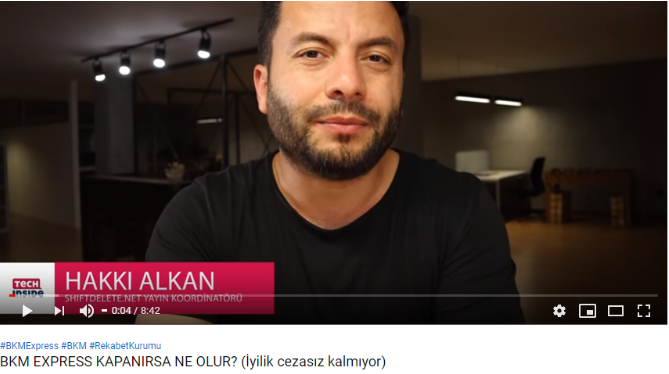

# Bkm Express ve Rekabet Kurumu

Rekabet kurumu 30 Mayıs’da [_Rekabetin Korunması Hakkında Kanun_](https://www.rekabet.gov.tr/tr/Sayfa/Mevzuat/4054-sayili-kanun)_u u_yarınca Bkm Express hizmetinin [_kapatılmasına karar vermiş_](https://www.rekabet.gov.tr/tr/SonKurulKarari/36540b6f-3394-e911-80fd-00505694b4c6?AspxAutoDetectCookieSupport=1) ve çok tepki çekmişti.

Ardından Bkm’den yapılan [_duyuru_](https://bkm.com.tr/kurumsal-iletisim/duyurular/rekabet-kurulunun-bkm-express-karari-hakkinda-aciklama/) ile Rekabet Kurumu’nun açıklayacağı gerekçeli kararda belirtilecek esaslarla uyumlu bir şekilde Türkiye’nin Dijital Cüzdanı Bkm Express’in ülke hedefleri doğrultusunda hizmet vermeye devam edeceği belirtildi.

9 Eylül’de Rekabet Kurumu konu hakkındaki [_gerekçeli kararı_](https://www.rekabet.gov.tr/Karar?kararId=48a3b64c-ec3a-4460-8ed1-6aa75d68f1a1) __kamuoyu ile paylaştı. Ardından BKM tarafından da, gerekçeli kararda belirtilen unsurlar gözetilerek BKM Express hizmetinin sürmesi için yürütülen çalışmanın planlanacağı [_açıklandı_](https://bkm.com.tr/rekabet-kurulunun-bkm-express-karari-hakkinda-aciklama-2/)_._

Rekabet Kurumu gerekçeli kararının içeriğini özetlemeye, buna ek olarak Bkm Express hayatına nasıl devam edecek konusunda da birkaç tahminimi paylaşmaya çalışacağım.

**Yazıda 5 ana bölüm var;**

**1-** Rekabet Kurumu ve Bkm Hakkında Kısaca

**2-** Rekabet Kurumu kararına gelen tepkiler

**3-** Rekabet Kurumu Gerekçeli Kararı

**4-**Bkm Express’de Nasıl Değişiklikler Olacak

**5-** Sonuç

### 1- Rekabet Kurumu ve Bkm Hakkında Kısaca? 

Rekabet Kurumu ve Bkm ne yapar kısaca bakalım.

Rekabet Kurumu; kartelleşmeyi ve tekelleşmeyi engellemek, tüketici faydasını artırmak, piyasa mekanizmasının sağlıklı bir şekilde işlemesine katkı sağlamak, uluslararası rekabet gücünün artırılmasına katkıda bulunmak ve giriş engellerini azaltarak yatırım ortamının sağlıklı işlemesini temin etmek amacıyla 4054 sayılı Rekabetin Korunması Hakkında Kanun’u uygulamakla yükümlü otoritedir.

Bankalararası Kart Merkezi, kısaca Bkm; 13 kamu ve özel Türk bankasının ortaklığıyla 1990 yılında hayatına başlamış bir kurumdur. Şu anda banka, ödeme kuruluşu ve elektronik para kuruluşlarından oluşan [_35 üyesi bulunmaktadır._](https://bkm.com.tr/bkm-hakkinda/ortaklar-ve-uyeler/uyeler/)\_\_

Bkm’nin amacı ödeme sistemleri içerisinde; nakit kullanımı gerekmeksizin her türlü ödemeyi veya para transferini sağlayan veya destekleyen sistem, platform ve altyapıları oluşturmak, işletmek ve geliştirmektir.

[_Bkm’nin resmi sitesinde_](https://bkm.com.tr/bkm-hakkinda/bkmyi-taniyin/tarihce/) belirtilen ana faliyet alanları;

Kredi kartı ve banka kartı uygulaması içinde bulunan bankalar arasında uygulanacak prosedürleri geliştirmek, standardizasyonu sağlamaya yönelik çalışmalar yaparak kararlar almak, Türkiye genelinde uygulamalar ile yurt içi kuralları oluşturmak, bankalar arasındaki [_takas_](https://bkm.com.tr/urunler-ve-hizmetler/takas-ve-hesaplasmaya-aracilik-hizmetleri/) ve hesaplaşmayı yürütmek, yurt dışı kuruluş ve komisyonlarla ilişkiler kurmak ve gerektiğinde üyelerini bu kuruluşlarda temsil etmek, halen her banka tarafından devam ettirilen işlemleri daha güvenli, süratli ve daha az maliyetli tek bir merkezden yürütmek.

Biz Bkm’yi daha çok Bkm Express, ve Troy ile tanıyoruz.

Bkm Express; kart sahiplerinin, kartlarını kaydederek kart bilgilerini internette paylaşmadan alışveriş yapabilecekleri bir dijital cüzdan.

Rekabet kurumu Bkm’yi [_**Teşebbüs Birliği**_](https://www.rekabet.gov.tr/tr/Sayfa/Rekabet-savunuculugu/rekabet-hukuku/rekabet-hukukunun-esaslari/temel-kavramlar) __olarak tanımlamaktadır ve Bkm’nin halihazırdaki birçok hizmeti rekabet kurumundan muafiyet iznine sahip, bunların en önemlileri takas işlemi ve takas komisyonunun belirlenmesi ile milli gururumuz Troy ödeme sistemi.

Bkm Express hizmeti de bu güne kadar Rekabet Kurumu’nun [_muafiyet verdiği_](https://www.rekabet.gov.tr/Karar?kararId=920d11a2-04d7-4bda-9e94-90318349c886) __hizmetlerden biriydi.

Peki rekabet kurumu, Bkm Express hakkındaki fikrini neden değiştirdi?

Özellikle Twitter’da, “madem kanuna aykırı idi neden daha önce izin verilmişti” sorusu çok fazla yer aldı.

Rekabet kurumu aşağıda belirtilen şartların tamamının varlığı halinde, teşebbüsler arası anlaşma, uyumlu eylem ve teşebbüs birlikleri kararlarının rekabet kanunu hükümlerinin uygulanmasından muaf tutulmasına karar verebilir:

a\) malların üretim veya dağıtımı ile hizmetlerin sunulmasında yeni gelişme ve iyileşmelerin ya da ekonomik veya teknik gelişmenin sağlanması,  
b\) tüketicinin bundan yarar sağlaması,  
c\) ilgili piyasanın önemli bir bölümünde rekabetin ortadan kalkmaması,  
d\) rekabetin \(a\) ve \(b\) bentlerindeki amaçların elde edilmesi için zorunlu olandan fazla sınırlanmaması.

Temel olarak, rekabet kurumu, daha önce Bkm Express uygulamasının toplumsal fayda sağladığı \(Rekabet Kurumu genel olarak Etkinlik kazanımı olarak ifade ediyor\) için izin vermiş. Muafiyet kararına buradaki [_linkten_](https://www.rekabet.gov.tr/Karar?kararId=920d11a2-04d7-4bda-9e94-90318349c886) __ulaşabilir ve Rekabet Kurumu’nun nelere dayanarak böyle bir karar verdiği hakkında daha ayrıntılı fikir edinebilirsiniz. Bu rapor Rekabet Kurumu’nun konuyu nasıl değerlendirdiğini anlamaya yardımcı olacaktır

Zaman içerinde fintech sektörünün büyümesi, benzer dijital cüzdan projeleri yapmak isteyen kurumların doğmasıyla birlikte; Bkm Express uygulamasının rekebeti kısıtlayan özelliklerinin etkinlik kazanımının önüne geçtiğini düşünerek muafiyeti kaldırmış. Bu konuda gerekçeli kararda belirtilen ayrıntılara yazının devamında değineceğim. Ama gerekçeli karara geçmeden önce, kapatılma duyurusuna gelen ilk tepkilerden birkaçını daha paylaşmak istiyorum.

### 2- Rekabet Kurumu kararına gelen tepkiler 

**İyilik cezasız kalmıyor :**

**Oh olsun :**

Bu yorumlardan birinde Rekabet Kurumu’na birinde de Bkm’ye haksızlık yapılmış.

Karara en sık gelen tepkilerden biri de, “_kim şikayet etti?”._

Rekabet kurumunun inceleme yapması için bir şikayet olmasına gerek yok. Bu incelemeyi tetikleyen konu ise Bkm Express’ten ayrı olarak Bkm’nin sunduğu [_kart saklama hizmeti_](https://www.rekabet.gov.tr/Karar?kararId=2939f38d-c934-4556-855f-4295d74b9c84). Konunun dağılmaması için buraya daha fazla girmeyeceğim. Diğer taraftan kurul kararını okur iseniz, içerisinde bankalar, ödeme kuruluşları ve eticaret sitelerin bulunduğu 50'ye yakın kurumdan konu hakkında görüş topladığını görebilirsiniz.

Bunların ötesinde kararı Facebook’un Libra Coin’i ile Rocafeller ailesi ile ilişkili olabileceğini düşünenler var ki, onlar konudan zaten çok çok uzaktalar.

Uzun bir girişten sonra, asıl konumuza gelebiliriz. Rekabet Kurumu neden bu kararı verdi?

### 3- Rekabet Kurumu Gerekçeli Kararı 

Gerekçeli kararda öne çıkan 3 nokta var;

**a- Kart numarasının tamamı olmadan işlem yapabilme:**

Bkm Express ile kart numarasının sadece ilk 6 ve son 4 hanesi, Cvv ve Tc No alınarak işlem yapılabiliyor. Yani Bkm Express sizin kart numaranızın aradaki 8 hanesi ve son kullanma tarihi bilgisine ihtiyaç duymuyor, bankalarla olan entegrasyonu sayesinde bu bilgiler olmadan kartınızdan işlem yapılabiliyor.

BKM dışındaki bir firma ise cüzdan uygulaması için bankalardan bu hizmeti alamıyor.

Bankaların bu hizmeti diğer firmalara sunmak istememesinin temel sebebi güvenlik çekinceleri, bunda da haksız sayılmazlar.

**b- Kartların son kullanma tarihlerinin otomatik olarak güncellenmesi**

BKM Express’e kaydedilmiş kartlarla yapılacak ödeme işlemlerinde, bu kartların son kullanma tarihi bilgisi otomatik olarak güncellenmektedir. Bu özellik de bir önceki maddedeki gibi bankalar tarafından sadece BkmExpress için sunulmaktadır.

**c- Bankalar tarafından gönderilen doğrulama sms’i**

Bkm Express ile bir işlem yapmak istediğinizde, ödeme adımında kartınızın bankası tarafından Bkm Express’e özgü bir doğrulama sms’si gönderiliyor.

Bu doğrulama hizmetinin amacı işlemi yapan kişiyle kart hamilinin aynı kişiler olduğunu teyit etmektir.

BKM Express dışındaki dijital cüzdan hizmetleri bankalardan aynı hizmeti alamadıkları için klasik 3ds doğrulaması kullanıyor.

Burada bankalardan aynı hizmeti alan istisna bir kurum daha var o da Masterpass. Bu yazıda farklılıklarına değinmeyeceğim ama kart kayıt ve ödeme anında dijital cüzdanların istedikleri bilgilere dair farklılıkları içeren, rapordan aldığım bir özet tabloyu da aşağı ekledim.

Bu üç hizmetin cüzdan uygulaması sunmak isteyen diğer firmalar tarafından kullanılamaması sektörde yeni uygulamaların yaygınlaşmasının önüne geçtiği gerekçesi ile Rekabet Kurumu Bkm Express uygulamasının kapatılmasına karar verdiğini açıkladı.

Bankalar tarafından bu hizmetlerin niye diğer firmalara sunulmak istenmediğini anlamak zor değil. Tamamiyle güvenlik çekinceleri ile alakalı.

Kart numarası ve son kullanma tarihi, kart üzerindeki güvenlik sağlayan unsurlar. Bu bilgilerin tamamı olmadan işlem yapabilmek, kartlı ödemelerdeki güvenliği azaltıyor. Bu sebeple bankalar tarafından sadece Bkm’ye bu hizmeti sağlayabilecek servisler verilmesi şaşırtıcı değil.

Yine aynı şekilde, başka bir firma adına bankanın doğrulama sms’i göndermesi de güvenlik zafiyetleri doğurabilecek bir durum. Bankalar bu hizmeti Bkm Express, ve güvenilirliğine emin oldukları Masterpass için sunuyor.

Daha önce belirttiğim gibi rapor bu 3 madde için, 50'ye yakın farklı kuruluştan alınan görüşleri içeriyor. Rekabet ve Bkm konusunundan bağımsız değerlendiğimizde de, bu görüşler fintek sektörü, kartlı ödemeler, dijital cüzdanlar, epara, kartlı ödemelerin güvenliği, dikey ve yatay ticari ilişkiler konusunda bu yazıya sığmayacak eşsiz faydalı bilgiler sunuyor. Bu yüzden muhakkak okumanızı tavsiye ediyorum.

Bu 3 madde dışında raporda, Bkm Express giderlerinin karşılanması ve Bkm’nin takas hizmeti hakkında da kısımlar mevcut. Bu yazıda bu kısımlara girmeye gerek duymuyorum.

Bkm, gerekçeli kararda belirtilen noktalarla uyumlu olarak hizmetine devam edeceğine dair 2 duyuru yapmıştı. Yazının bir sonraki başlığında nasıl bir değişiklik ile hayatına devam edebileceğine dair tahminlerimi paylaşacağım.

### 4-Bkm Express’de Nasıl Değişiklikler Olacak 

Yukarda bahsettiğimiz 3 özellik için de bankalar sadece belli lisanslara sahip, Btk gibi kurumlar tarafından denetlenen diğer ödeme kuruluşlarına sunabilirler. Fakat tüm denetimlere rağmen yine de güvenlik çekinceleri var olacaktır. Dünyada bir örneği olmadığı için de bu konuda yorum yapmak gerçekten zor. Aşağıda bu ihtimal dışındaki ihtimallerden ayrı ayrı bahsettim.

**a - Kart numarasının tamamı olmadan işlem yapabilme**

Bkm kart numarasının tamamını alabilir. Kart numarasını vermek için Bkm’den daha güvenli bir kurum olabileceğini düşünmüyorum, Bkm Express’i değerli yapan kart numarasını kısmen alması değil, internet ekosistemi ile entegre en güvenli, kullanıcı dostu cüzdan olması. Tahminim değişikliğin bu yönde olacağı. Eğer Bkm bu şekilde ilerlerse halihazırda kayıtlı kartlarımız için kart numarasını sanırım tekrar girmeniz gerekebilir.

**b-Son kullanma tarihinin manuel güncellenmesi**

Kartın son kullanma tarihi dolduğunda otomatik güncellenmesi yerine kart sahibi tarafından güncellenebilir. Kullanıcı dostu olan bir özellik eksilmiş olacak.

**b- Doğrulama sms’i**

Ödeme anında bankadan gelen tek kullanımlık şifre sms’i üye işyeri açısından kart sahibini doğrulamayi sağlıyor.

Bu özelliğin diğer firmalara da sunulmasında güvenlik çekincesinden de öte, böyle bir özelliği sunduktan sonra, kendisine mesaj giden kullanacılara verilecek destek hizmetindeki operasyonel zorlukları da tahmin edebiliriz. Eğer böyle bir karar verilirse bu konuya tekrar dönelim. Şimdilik diğer seçeneğe bakabiliriz.

Bu hizmet yerine, daha çok aşina olduğumuz 3ds kullanılabilir, fakat e-ticaret sitesinin sayfasından, önce Bkm Express sayfasına yonlenen kullanıcıyı ardından 3ds sayfasına yönlendirmek kullanıcı deneyimini halihazırdakiden biraz daha karmaşık hale getiriyor. Birçok eticaret sitesi gibi 3ds sayfasını bir popup içinde göstermeyi tercih etse de Bkm Express’in şu anki doğrulama yöntemi kadar kullanıcı dostu olmayacak.

Belki de sadece ilk kart kaydetme adımında ve bazı işlemlerde 3ds’e yönlenen bir yöntem tercih edilebilir.

İlerde 3ds 2.0 ile çok daha kullanıcı dostu ve güvenli kart sahibi doğrulama yöntemlerimiz olacak ama şu an Bkm bu konuda nasıl ilerleyecek bekleyip göreceğiz.

### **5- Sonuç** 

Bkm Express hakkındaki kararı sebebiyle Rekabet Kurumu’nu acımasızca eleştirmek doğru bir tutum değil.

Diğer taraftan, _Nakitsiz Toplum_ adına Türkiye’deki en değerli adımlardan biri Bkm Express. Gelecekte çıkacak cüzdanlar için bir referans noktası. Kapanması Türkiye için bir kayıp olur.

Bir tarafta; yerli kart network’ümüz Troy ile ödeme yapmamızı sağlayan, dijital ödemeler için eşsiz kolaylıklar getiren BkmExpress cüzdanını hayata geçiren Bkm; diğer tarafta toplum faydası için önemli olan Rekabet Kanununu uygulamakla görevli Rekabet Kurumu.

Biz son kullanıcılar için iki kurum arasında fanatik bir tutum ile taraf tutmaya, kutuplaşmaya gerek olmadığını düşünüyorum.

Bkm’ye de Rekabet Kurumu’na da güvenebileceğimize inanıyorum.

Sonuç her ne olursa olsun Bkm’nin geçmişte olduğu gibi gelecekte de fintech ekosistemi için lokomotif olarak devam edeceğine eminim.

Hem ülke, hem sektör hem de biz bireysel kullanıcılar için en iyi olanın önümüzdeki günlerde hayata geçeceğini umuyorum.

Yazı hakkındaki tüm soru ve görüşlerinizi yorum olarak paylaşabilirsiniz. Eklemek, düzeltmek istediğiniz bir nokta var ise çekinmeden iletebilirsiniz.

### _Kaynaklar :_ 

[Bankalararası Kart Merkezi A.Ş. bünyesinde BKM Express adı altında sunulmakta olan dijital cüzdan hizmeti uygulamasına 4054 sayılı Kanun’un 5. maddesi uyarınca bireysel muafiyet tanınması talebi.](https://www.rekabet.gov.tr/Karar?kararId=48a3b64c-ec3a-4460-8ed1-6aa75d68f1a1)

[_Bkm tarafından yapılan ilk açıklama_](https://bkm.com.tr/kurumsal-iletisim/duyurular/rekabet-kurulunun-bkm-express-karari-hakkinda-aciklama/)

[_Bkm faliyet alanları_](https://bkm.com.tr/bkm-hakkinda/bkmyi-taniyin/tarihce/)

[_Bkm ürün ve hizmetleri_](https://bkm.com.tr/urunler-ve-hizmetler/troy/)

[_4054 sayılı rekabetin korunması hakkında kanu_](https://www.rekabet.gov.tr/tr/Sayfa/Mevzuat/4054-sayili-kanun)_n_

[_Dr. Av. Oğuzkan Güzel’in “Rekabet Kurumu’nun Zoraki Regülasyon Görevi; Bankalararası Kart Merkezi Muafiyet Kararları_](https://www.youtube.com/watch?v=blwT3pjEjfo)_” sunumu._

[_Emre Faik; 3DS 2.0'a Hazır mısınız?_](https://medium.com/kartliodemeler/3ds-2-hazir-misiniz-4f0f1f3d4a69)

_Finartz;_ [_Hap Bilgi Niyetine \| Online Güvenli Ödeme ve 3D Secure 2.0_](https://medium.com/@finartz_com/hap-bilgi-niyetine-online-g%C3%BCvenli-%C3%B6deme-ve-3d-secure-2-0-84aa2022a1507)

[_Rekabet Kurumu’nun Bkm Express için yılındaki muafiyet kararı_](https://www.rekabet.gov.tr/Karar?kararId=920d11a2-04d7-4bda-9e94-90318349c886)_\(2016\)._

[_Rekabet Kurumu, Bkm kart saklama hizmetine ek muafiyet tanınmaması kararı_](https://www.rekabet.gov.tr/Karar?kararId=2939f38d-c934-4556-855f-4295d74b9c84) _\(2018\)._

[_Rekabet Kurumu, BKM’nin Takas komisyonlarını belirlemesine yönelik muafiyet kararı_](https://www.rekabet.gov.tr/Karar?kararId=2b0c4971-b9fe-4174-bc6e-96f6a10e81ff) _\(2017\)_

[_Rekabet Kurumu’nun Troy hakkındaki muafiyet kararı_](https://www.rekabet.gov.tr/Karar?kararId=9e94c215-4fe7-4f7a-91dd-ae34b5b11376) _\(2018\)_[kartliodemeler](https://medium.com/kartliodemeler?source=post_sidebar--------------------------post_sidebar-)

