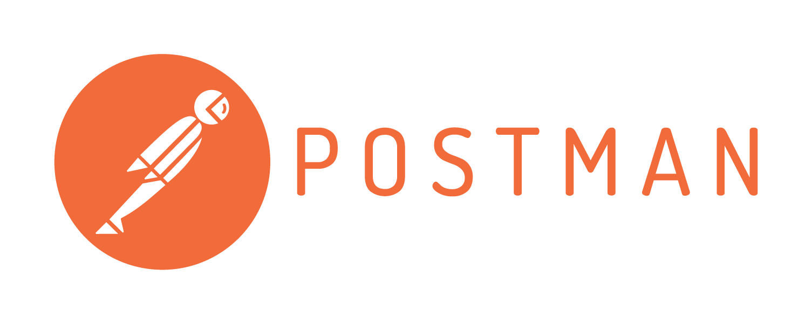

# Postman

Postman kullanımı hakkında hazırladığım yazılara aşağıdaki linklerden ulaşabilirsiniz.

[1-Nedir](https://medium.com/postman-collections/postman-nedir-622be8afef2e)

[_2-Kurulum ve İlk Sorgu_](https://medium.com/postman-t%C3%BCrkiye/postman-kurulum-1cee745543b3)

[3-Arayüz](https://medium.com/@kurtulussahin/postman-arayuz-84fae9fb1f72)

[4-Sorgular](https://medium.com/postman-t%C3%BCrkiye/postman-sorgular-83ed79c81225)

[5-Kütüphaneler](https://medium.com/postman-t%C3%BCrkiye/postman-collections-cf2ed61a4276)

6-Scriptler

7-Environment’lar

8-Dökümantasyon

9-Monitoring

